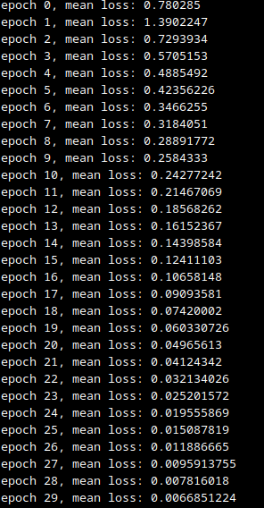
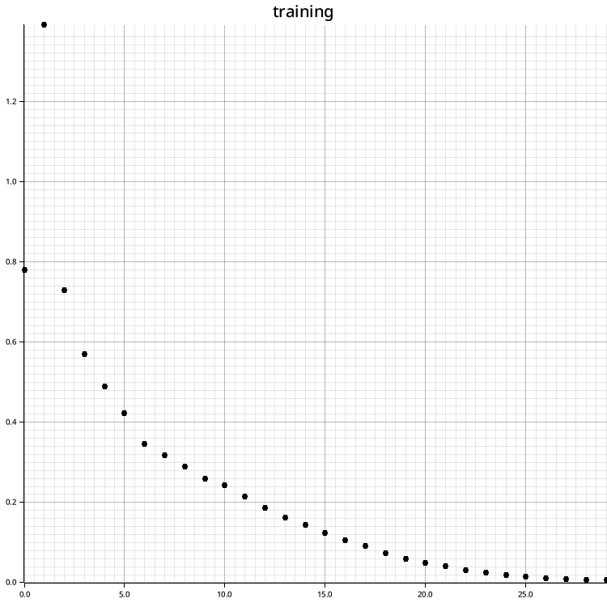
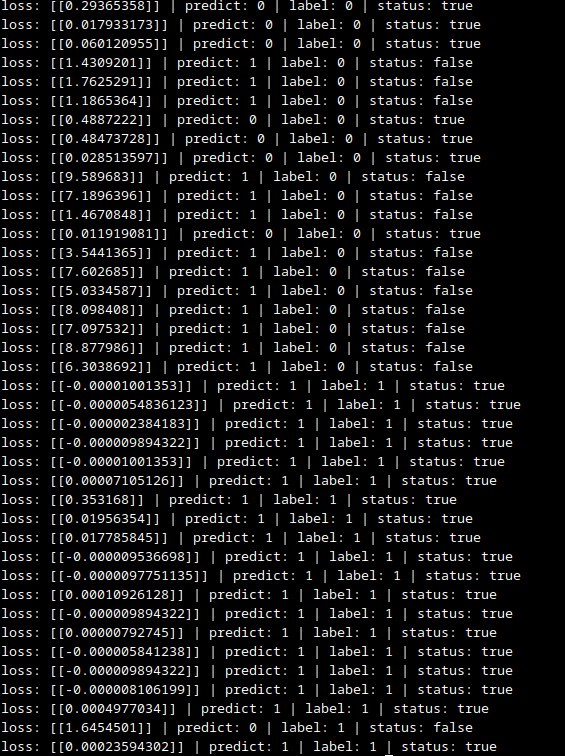
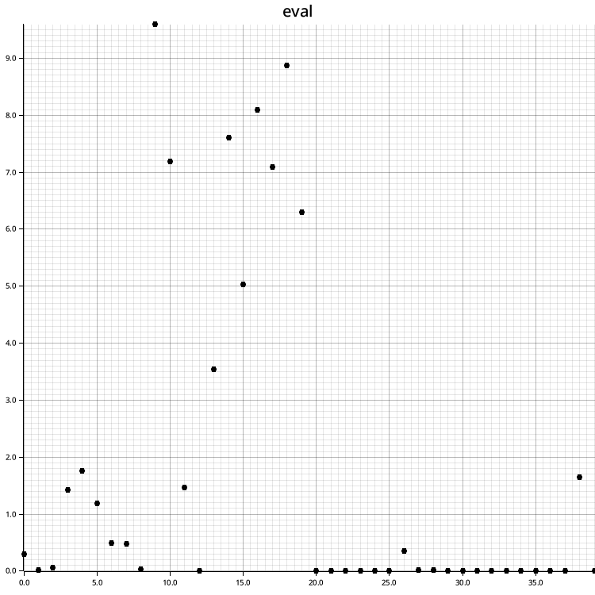

# CAPSTONE OR-15 NEO TELEMETRI
## M.Yazem Agva Roiz
### PROGRAMMING SUB DIVISI MACHINE LEARNING

## Workflow
Diawali dengan pemilihan dataset berupa dataset untuk membedakan gambar seseorang menggunakan kaca mata dan tidak, 

### Dataset
dataset di dapatkan dari kaggle dengan link:
[https://www.kaggle.com/datasets/ashfakyeafi/glasses-classification-dataset](https://www.kaggle.com/datasets/ashfakyeafi/glasses-classification-dataset)

pada program, terdapat function untuk mengambil dataset untuk training dan test, melalui function [get_train_dataset](./src/get_train_dataset.rs) dan [get_test_dataset](./src/get_test_dataset.rs).

### Plot Draw
lalu terdapat program yang berfungsi untuk membuat sebuah grafik plot melalui function [draw_plot](./src/draw_plot.rs)

### Model
dalam pelatihan model, menggunakan struktur model CNN yang dapat dilihat pada [model_train](./src/model/model_train) yang berfungsi untuk training dan save parameters. Secara umum bentuk model seperti dibawah ini
```rust
    // model
    let mut conv2d_1 = Conv2DNonBatch::new(3, 8, 3);
    let max_pooling_1 = MaxPooling2DNonBatch::new(2, 2);
    
    let mut conv2d_2 = Conv2DNonBatch::new(8, 16, 3);
    let max_pooling_2 = MaxPooling2DNonBatch::new(2, 2);
    
    let mut conv2d_3 = Conv2DNonBatch::new(16, 32, 3);
    let max_pooling_3 = MaxPooling2DNonBatch::new(2, 2);
    
    let mut linear_1 = LinaerNonBatch::new(1152, 512);
    let mut linear_2 = LinaerNonBatch::new(512, 2);
    let mut softmax = Softmax::new(1);
    // model
```
untuk loss function menggunakan cross entropy loss dan optimazer menggunakan Adam.

### Training
Untuk training, hanya menggunakan dataset untuk training [get_train_dataset](./src/get_train_dataset.rs) tanpa penggunaan data testing, dikarenakan untuk tidak memakan terlalu banyak peforma.
Untuk melakukan training menggunakan function [model_train](./src/model/model_train).
untuk hasil training menggunakan function [draw_plot](./src/draw_plot.rs) yang telah di siapkan sebelumya. dengan hasil:


</img>


</img>

dapat dilihat dari gambar bahwa dilakukan 20 epoch dengan nilai loss yang menurun, menandakan model belajar dengan baik.

### save params
penyimpanan parameters secara otomatis di saat penggunaan [model_train](./src/model/model_train), terdapat pada bagian:
```rust
    conv2d_1.saving_params("params/conv2d_1.json").unwrap();
    conv2d_2.saving_params("params/conv2d_2.json").unwrap();
    conv2d_3.saving_params("params/conv2d_3.json").unwrap();
    linear_1.saving_params("params/linear_1.json");
    linear_2.saving_params("params/linear_2.json");
```
semua paramaters akan disimpan dalam bentuk json di dalam folder [params](./params)

### Testing
untuk testing, menggunakan dataset testing melalui function [get_test_dataset](./src/get_test_dataset.rs) dan menggunakan function [model_load](./src/model/model_load.rs).
model akan secara otomatis load parameters yang telah di simpan pada folder [params](./params), bagian code yang bertanggung jawab kurang lebih seperti yang ada di bawah ini:
```rust
    // model
    let mut conv2d_1 = Conv2DNonBatch::new(3, 8, 3);
    conv2d_1.load_params("params/conv2d_1.json");

    let max_pooling_1 = MaxPooling2DNonBatch::new(2, 2);

    let mut conv2d_2 = Conv2DNonBatch::new(8, 16, 3);
    conv2d_2.load_params("params/conv2d_2.json");

    let max_pooling_2 = MaxPooling2DNonBatch::new(2, 2);

    let mut conv2d_3 = Conv2DNonBatch::new(16, 32, 3);
    conv2d_3.load_params("params/conv2d_3.json");

    let max_pooling_3 = MaxPooling2DNonBatch::new(2, 2);

    let mut linear_1 = LinaerNonBatch::new(1152, 512);
    linear_1.load_params("params/linear_1.json");

    let mut linear_2 = LinaerNonBatch::new(512, 2);
    linear_2.load_params("params/linear_2.json");

    let mut softmax = Softmax::new(1);
    // model
```
hasil testing berupa:


</img>


</img>

dapat dilihat diatas, bahwa model memberikan prediksi yang masih belum baik, dari loss yang di dapatkan saat training dengan hasil evaluasi model, maka disimpulkan bahwa model mengalami overfitting.
